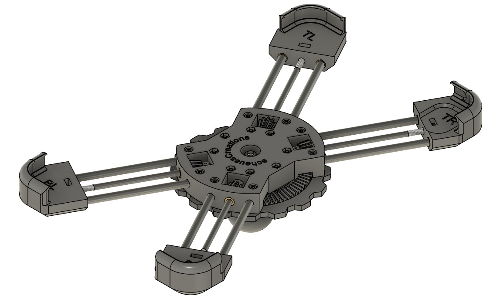
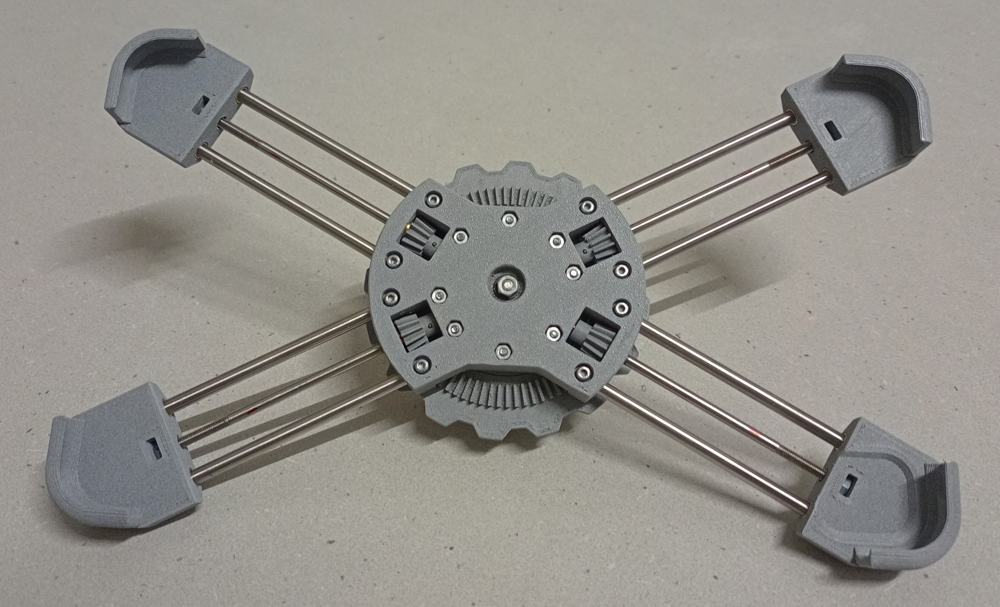
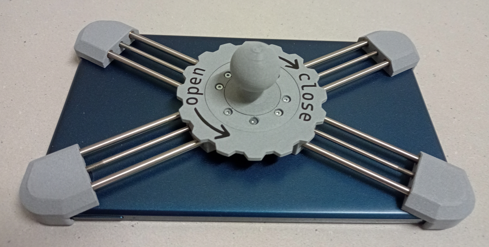
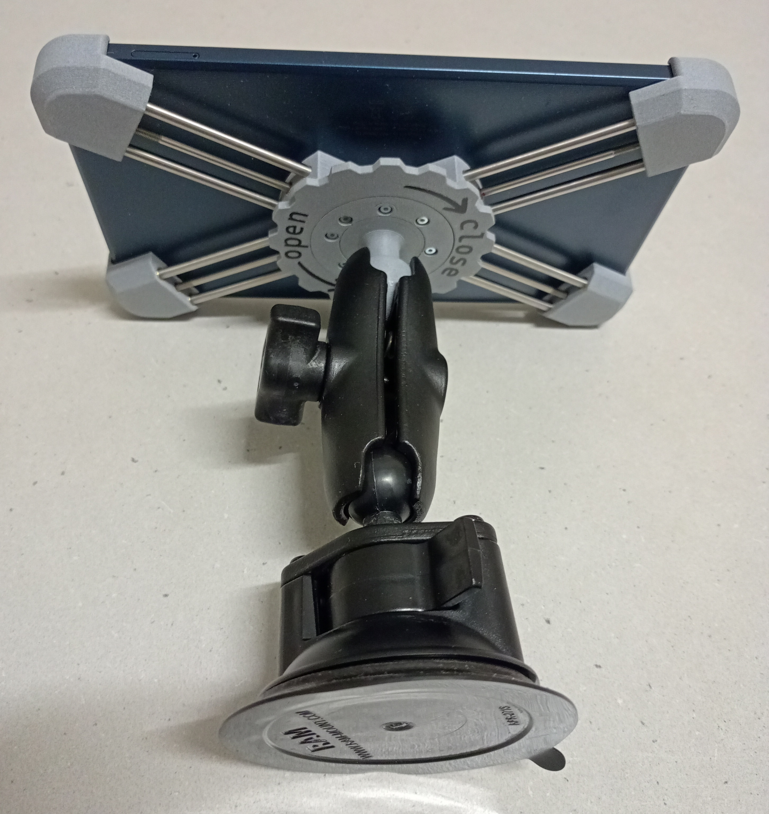
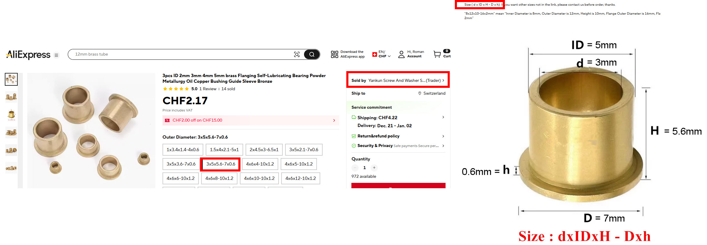

# Tablet Holder Nokia T10

## Description

  
  
  
  

This construction is a holder for the Nokia T10 tablet. I couldn’t find a good tablet holder for my Nokia T10, so I designed one myself. By rotating the ring gear on the back side, all four pinion gears drive the M3 spindles. This moves all four corners toward the center and clamps the tablet on all edges. It works very well and the tablet looks good in the holder.

On the back side, there is a spherical mount for attaching a suction mount.

The M3×40 mm threaded rod in the middle is used for stability and prevents the sphere from breaking off. The M3 nut inside the sphere needs to be placed during printing. Simply add a stop at a height of 38.6 mm.

The holder was designed using Fusion 360. The gear is designed with the Fusion app GF Gear Generator.

All 3D-printed parts were printed on a Prusa MK3S+ with a layer height of 0.2 mm. Only the five gear parts were printed with a layer height of 0.1 mm.

It can be easily adapted for other tablets such as iPads or Samsung tablets.

Let me know if you have any questions.

Feel free to build your own tablet holder. Contributions to this project are very welcome; you may use the PayPal link.

## Parts and Materials
- All printed parts are made using ‘ProtoPasta Light Gray Carbon Fiber Composite HTPLA’ filament:
https://proto-pasta.com/products/light-grey-carbon-fiber-composite-htpla?variant=13870367899693  

- The shoulder bushings are sourced from AliExpress (select the correct size) but could also be made from brass:
https://de.aliexpress.com/item/1005009829181558.html?spm=a2g0o.order_detail.order_detail_item.3.34b3f19cH1WTkF&gatewayAdapt=glo2deu 

  

- The other bushings are made from brass tubes with the appropriate diameter.

- The M3 spindles and the other rods are made of stainless steel with a good surface finish (ground and polished?)

- I use the RAM Mount RAM-B-166-103U suction mount:
https://www.rammounts.de/en/part/ram-b-166-103u 

